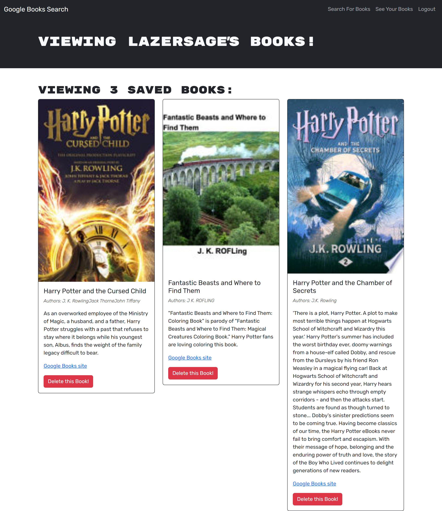

# Book-Search-Engine

## Description

For this project, I worked with the MERN stack, which includes MongoDB, Express, React, and Node.js. The main goal of this project was to refactor the existing codebase, transitioning it from a RESTful approach to a more flexible and efficient GraphQL implementation.

Throughout this project, I encountered several challenges, with the most significant one being familiarizing myself with the file structure. It took time to understand where each piece fit and how they interacted seamlessly. On the backend, setting up schemas, typedefs, and resolvers proved quite demanding. Similarly, on the frontend, I faced complexities in crafting pages, components, queries, and mutations to ensure smooth functionality. Despite these hurdles, the learning process was invaluable, and I am pleased with the outcomes achieved.

## Usage

Upon visiting the website's landing page, you will immediately encounter a convenient search bar. This feature enables you to input book titles, helping you discover books related to your queries.

However, to fully access the "Save This Book" button, you must first sign up and log in to your account. Once logged in, this button becomes visible.

When you click the "Save This Book" button, the chosen book will be securely stored within your personal profile. Later, when you access your profile, you will find a comprehensive list of all the books you have saved. This ensures easy retrieval and management of your favorite book selections.

Live Deployed URL: https://dashboard.heroku.com/apps/fathomless-meadow-56406  
GitHub Repo: https://github.com/TimeBytes/Book-Search-Engine

## Credits

Used University of Toronto Bootcamp Activities as reference for syntax and file structure.  
https://utoronto.bootcampcontent.com/utoronto-bootcamp/UTOR-VIRT-FSF-PT-02-2023-U-LOLC/-/tree/main/21-MERN

## License

MIT License
